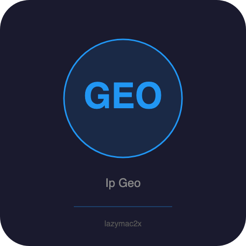

<p align="center"></p>

[](https://lazymac2x.github.io/lazymac-api-store/) [](https://coindany.gumroad.com/) [](https://mcpize.com/mcp/ip-geo-api)

# ip-geo-api

IP geolocation lookup REST API + MCP server.

Look up geographic location, ISP, timezone from IP addresses using [ip-api.com](http://ip-api.com) as backend (free, no key needed, 45 req/min).

## Quick Start

```bash
npm install
npm start        # REST API on http://localhost:4500
npm run mcp      # MCP server on stdio
```

## REST Endpoints

| Method | Path | Description |
|--------|------|-------------|
| GET | `/api/v1/lookup/:ip` | Single IP geolocation lookup |
| GET | `/api/v1/me` | Lookup requester's IP |
| POST | `/api/v1/batch` | Batch lookup (max 100 IPs) |
| GET | `/api/v1/validate/:ip` | Validate IP format (v4/v6) |
| GET | `/health` | Health check |

## Examples

```bash
# Single lookup
curl http://localhost:4500/api/v1/lookup/8.8.8.8

# My IP
curl http://localhost:4500/api/v1/me

# Batch
curl -X POST http://localhost:4500/api/v1/batch \
  -H "Content-Type: application/json" \
  -d '{"ips":["8.8.8.8","1.1.1.1"]}'

# Validate
curl http://localhost:4500/api/v1/validate/192.168.1.1
```

## MCP Server

Add to your MCP client config:

```json
{
  "mcpServers": {
    "ip-geo-api": {
      "command": "node",
      "args": ["src/mcp-server.js"],
      "cwd": "/path/to/ip-geo-api"
    }
  }
}
```

### Tools

- `ip_lookup` — Single IP geolocation lookup
- `ip_batch_lookup` — Batch lookup (max 100)
- `ip_validate` — Validate IP format

## Features

- In-memory cache with 5-minute TTL
- IPv4 and IPv6 support
- Rate-limit friendly (batching, caching)
- Docker ready

## Docker

```bash
docker build -t ip-geo-api .
docker run -p 4500:4500 ip-geo-api
```

## Response Fields

`ip`, `country`, `countryCode`, `region`, `regionCode`, `city`, `zip`, `lat`, `lon`, `timezone`, `isp`, `org`, `as`

## License

MIT
